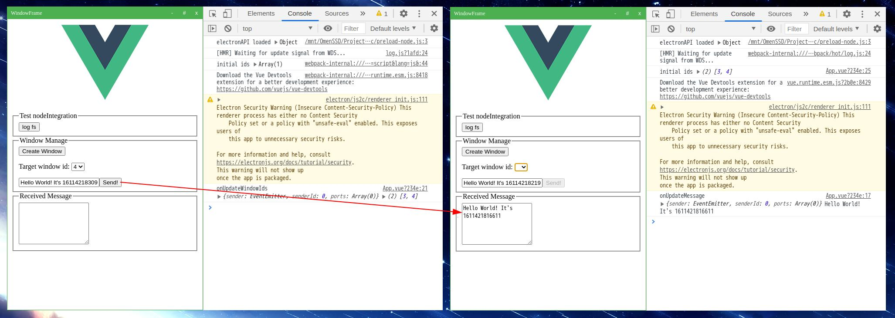

# Electron 多窗口通信 Demo

框架：Electron + Vue（前端分离） 



## Demo 功能

- 启动 Splash 视图
- 自定义窗口，最大化、最小化、切换
- 创建无限多个窗口
- 窗口间数据通信
- 使用 preload 调用方式
- 支持关闭 nodeIntegration

## 使用方式

```sh
# 安装依赖
yarn && cd frontend && yarn

# 启动静态页面前端
yarn serve-public

# 启动 Vue 前端
cd frontend && yarn serve

# 启动 Electron
yarn dev
```

## 参考

- [multiple-windows](https://github.com/akabekobeko/examples-electron/tree/develop/multiple-windows)
